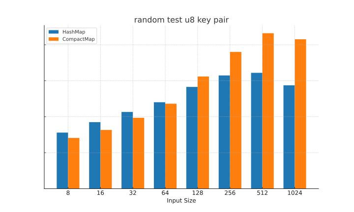
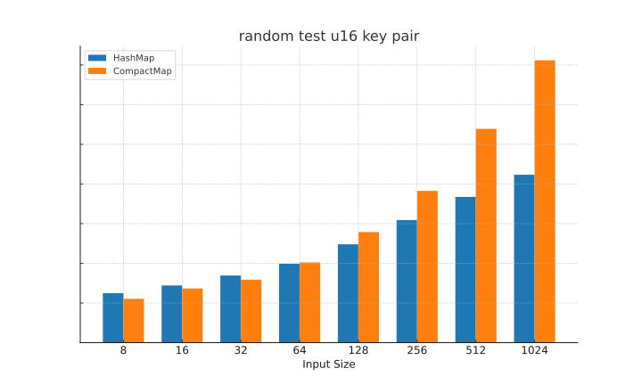
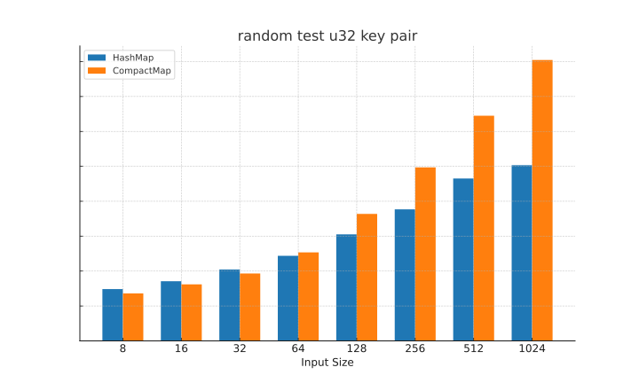
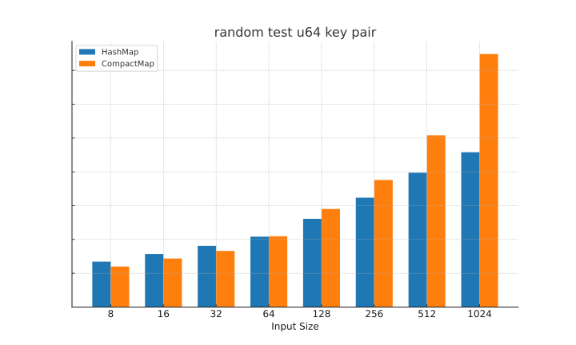
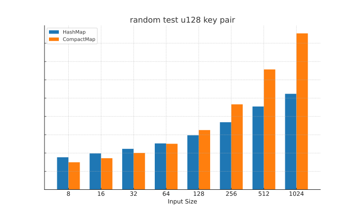

# compact-map

[![Crates.io][crates-badge]][crates-url]
[![Documentation][docs-badge]][docs-url]
[![Latest Docs][docs-badge-latest]][latest-docs-url]
![MIT licensed][license-badge]
[](https://app.fossa.com/projects/git%2Bgithub.com%2Flightsing%2Fcompact-map?ref=badge_shield)

[crates-badge]: https://img.shields.io/crates/v/compact-map.svg
[crates-url]: https://crates.io/crates/compact-map
[docs-badge]: https://docs.rs/compact-map/badge.svg
[docs-url]: https://docs.rs/compact-map
[docs-badge-latest]: https://img.shields.io/badge/docs-latest-blue
[latest-docs-url]: https://lightsing.github.io/compact-map/compact_map/
[license-badge]: https://img.shields.io/badge/license-MIT%20OR%20Apache2.0-blue.svg

'Small map' optimization: store up to a small number of key-value pairs on the stack.

Provides '1:1' API compatibility with `std::collections::HashMap`.

## Example

```rust
use compact_map::CompactMap;

fn main() {
    let mut map = CompactMap::default(); // default capacity is 16
    // or you can specify the capacity
    // let mut map: CompactMap<&str, i32, 32> = CompactMap::default();

    map.insert("a", 1);
    map.insert("b", 2);
}
```

## Performance

Consider using `CompactMap` when the number of key-value pairs is small (e.g., less than 32).

The following benchmarks are generated using `criterion` with `HashMap` as the baseline
on a machine with an AMD Ryzen 9 5950X CPU and 128GB of 2400MHz DDR4 RAM.

The benchmark code can be found in the `benches` directory.

The benchmark uses a random action sequence of 1000 insertions, deletions with different key types.

**Note**: Smaller is better.
<p align="center">





</p>

## License
[](https://app.fossa.com/projects/git%2Bgithub.com%2Flightsing%2Fcompact-map?ref=badge_large)